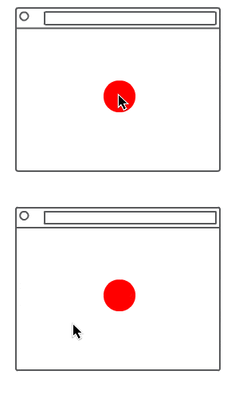

<div align="center">


<!--  -->
<!--  -->
<!--  -->
<!--  -->


[](https://www.notion.so/p5-party-Documentation-887564cad8ec455e9bee994362322f2e)
[](http://p5party.netlify.app)

Test Coverage:


</div>

## Multi-player Games with p5.js

p5.party is a library for easily prototyping online multi-user sketches with p5.js. With p5.party you can quickly test ideas for multiplayer games, realtime multi-user apps, and multi-computer art projects.

[Documentation](https://www.notion.so/p5-party-Documentation-887564cad8ec455e9bee994362322f2e)

[Demos + Examples](https://p5party.netlify.app/)

[Discussion](https://github.com/jbakse/p5.party/discussions)

## What is it good for?

**Prototyping + Sketching**

[p5.party](http://p5.party) provides a simple, imperative interface for working with shared data inspired by the programming conventions used by the [p5.js](https://p5js.org/) api. p5.party let's you try ideas quickly without writing server code or setting up a front-end/back-end stack.

**Workshops + Classes**

p5.party uses a [deepstream.io](http://deepstream.io) server which is easy to set up and cheap—or free—to run. Many sketches and projects can connect to the same p5.party server, so students can focus on sketching instead of setting up servers.

<!-- **Turn Based Games and Apps**

Quickly get people connected and playing together. Try out ideas using many of your existing skills in p5.js. -->

## What is it not good for?

**Production**

p5.party is designed for prototypes. As your project grows, you'll need to look into other libraries and backends that suit your project's needs.

**Security**

Sketches built with p5.party are insecure. p5.party has no method to authenticate or authorize users. Multiple apps share a server and can read, write, and delete each other's data.

<!-- **Fast-Action Games**

Fast-action multiplayer games are inherently complex. Compensating for network latency requires [prediction and reconciliation](https://www.gabrielgambetta.com/client-server-game-architecture.html) strategies which are somewhat application specific and outside the scope of p5.party. -->

## Features

**Shared Data Objects**

With p5.party you can easily create a shared data object that is automatically synchronized between instances of your sketch. You can assign and read properties on these objects just like a plain old local javascript object.

**Multiple Apps and Rooms**

A single p5.party server can support many apps and each app can group users into rooms. p5.party keeps track of which clients are in each room and shares the data to the right clients.

**Client-side Hosting**

p5.party automatically designates one (and only one) guest in each room as the host. Your code can easily check if it is the host and take care of running the party. This lets you avoid writing server-side code and makes prototyping faster.

## Show Me Some Code!



```html
<script src="https://cdn.jsdelivr.net/npm/p5@latest/lib/p5.js"></script>
<script src="https://cdn.jsdelivr.net/npm/p5.party@latest/dist/p5.party.js"></script>
```

```javascript
let shared;

function preload() {
  // connect to server
  partyConnect("...", "hello_party", "main");

  // load a shared data object
  shared = partyLoadShared("shared");
}

function setup() {
  createCanvas(400, 400);
  noStroke();
  fill("red");

  // set initial values if they are not set*
  shared.x ??= width * 0.5;
  shared.y ??= height * 0.5;
}

function mousePressed() {
  // write shared data
  shared.x = mouseX;
  shared.y = mouseY;
}

function draw() {
  background("white");
  // read shared data
  ellipse(shared.x, shared.y, 100, 100);
}
```

\*using the newish [ES2020 ??= Operator](https://developer.mozilla.org/en-US/docs/Web/JavaScript/Reference/Operators/Logical_nullish_assignment)

## Installation and Quickstart

The quickest way to get started with p5.party is to load it from a CDN.

```
https://cdn.jsdelivr.net/npm/p5.party@latest/dist/p5.party.js
```

Visit the [P5 Web Editor Quick Start Guide](https://cdn.jsdelivr.net/npm/p5.party@latest/dist/p5.party.js) to get started using p5.party in the p5.js web editor.

<!-- You can also download the latest release of p5.party from the [releases page on Github](https://github.com/jbakse/p5.party/releases). -->

Visit the [VS Code Quick Start Guide](https://www.notion.so/Hello-p5-party-c4c0f94127c1408e9d6dd51f91ac8414) to get started using p5.party in locally with VS Code.

## Server Installation

You can set up a server in a few minutes using Heroku and a clone of the p5.party repo.

[Server Setup](https://www.notion.so/Server-Setup-d039a4be3a044878bd5ad0931f1c93bd)

## Contributing

We welcome new contibuters. Please feel free to start a [discusion](https://github.com/jbakse/p5.party/discussions), [post issues](https://github.com/jbakse/p5.party/issues), or [request features](https://github.com/jbakse/p5.party/issues). If you want to help with writing code or documentation, you can start by indicating your interest on an open issue or by creating your own.

## License

Distributed under the MIT License. See `license` for more information.

## Acknowledgements

p5.party builds on [deepstream.io](http://deepstream.io) and [sindresorhus/on-change](https://github.com/sindresorhus/on-change). Deepstream is a realtime data-sync server that can be easily self hosted on services like [heroku](heroku.com) or [aws](https://aws.amazon.com/free). on-change uses javascript [proxies](https://developer.mozilla.org/en-US/docs/Web/JavaScript/Reference/Global_Objects/Proxy) to make a fully observable object. p5.party uses on-change to watch for changes to shared data objects and then communicates these changes to deepstream. p5.party also depends on a number of other great [packages](package.json).

- [deepstream.io](http://deepstream.io)
- [sindresorhus/on-change](https://github.com/sindresorhus/on-change)

## Contributors

p5.party was created by Justin Bakse, Munro Hoberman, and Isabel Anguera.

contributions by Tanvi Mishra, Apurv Rayate, Hyacinth Weng

## Thanks To

Jessie Han, An Kong, Kevin Lin, Malin Mabika, Tanvi Mishra, Brittany Price, Apurv Rayate, Beatriz Ribeiro Dos Santos, Tong Shao, Hyacinth Weng, Winnie Yuxiang Zhai, Joan Jingwen Zhang
